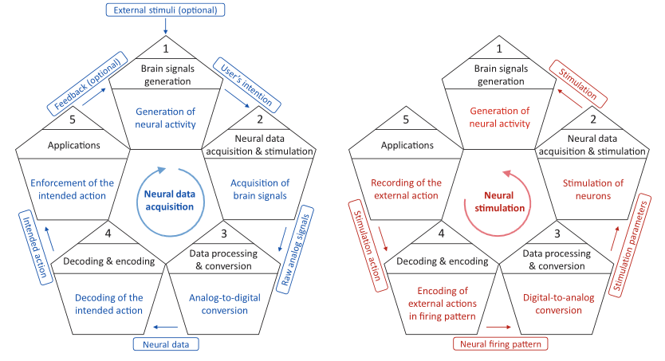

# INTRODUCCIÓN

Las Interfaces Cerebro-Computadora (BCI) surgieron en la década de 1970 con el objetivo de adquirir y procesar la actividad cerebral de los usuarios para luego realizar acciones específicas sobre máquinas o dispositivos externos. Después de varias décadas de investigación, esta funcionalidad se ha ampliado, permitiendo no solo la grabación de la actividad neuronal, sino también la estimulación cerebral. El texto describe un ciclo general de funcionamiento de las BCI, que incluye tanto la grabación como la estimulación de neuronas. Este ciclo se divide en dos direcciones: en el sentido de las agujas del reloj (en azul), que muestra el proceso de adquisición de datos neuronales, y en sentido contrario (en rojo), que representa la estimulación cerebral.

    

En cuanto a la adquisición de datos neuronales, las neuronas interactúan entre sí, produciendo actividad neuronal que puede estar basada en acciones previamente acordadas, como controlar un joystick, o generarse espontáneamente. Esta actividad es adquirida por la BCI y convertida en datos digitales. Luego, el sistema de procesamiento de datos de la BCI analiza los datos para inferir la acción que el usuario intenta realizar. Finalmente, las aplicaciones ejecutan esa acción, permitiendo el control de dispositivos externos. El ciclo de estimulación cerebral comienza cuando las aplicaciones definen las acciones de estimulación que se deben realizar, y luego, el patrón de estimulación es enviado a la BCI para estimular neuronas específicas en el cerebro, dependiendo de la tecnología utilizada.

Desde una perspectiva de seguridad, las BCI aún se encuentran en una etapa temprana y en desarrollo, y la literatura ha comenzado a considerar la seguridad en estos sistemas solo en los últimos años. Se han identificado ataques de seguridad que afectan la integridad, confidencialidad, disponibilidad y seguridad de las BCI, pero no se han realizado análisis exhaustivos ni se han abordado todas las preocupaciones relevantes. Además, el uso de BCIs para estimulación en entornos clínicos introduce vulnerabilidades graves que pueden tener un impacto significativo en la salud del usuario. Las BCI existentes en el mercado se beneficiarían de la implementación de soluciones de seguridad robustas, especialmente en entornos clínicos. También, la expansión de las BCI a nuevos mercados, como los videojuegos o el entretenimiento, presenta riesgos considerables en términos de confidencialidad de los datos.

En cuanto a la seguridad, el aumento de la cantidad de datos adquiridos y el uso de tecnologías potencialmente vulnerables, como las interfaces basadas en silicio, presentan nuevos desafíos. La revolución tecnológica actual, combinada con movimientos como el Internet de las Cosas (IoT), acelera la creación de nuevos dispositivos sin estándares de seguridad adecuados, lo que genera riesgos aún mayores. Además, surgen escenarios prospectivos, como las comunicaciones directas entre cerebros (Brain-to-Brain, BtB) y cerebros conectados a Internet (Brain-to-Internet, BtI), que demandarán esfuerzos significativos desde la perspectiva de la seguridad.

El artículo se enfoca en analizar los problemas de seguridad de los componentes de software que intervienen en los procesos y las comunicaciones de las BCI, así como las infraestructuras que las soportan, como computadoras, teléfonos inteligentes y plataformas en la nube. El objetivo principal es realizar un análisis de seguridad desde una perspectiva tecnológica, aunque también se abordan impactos en la seguridad física y en la integridad del cerebro del usuario. Este trabajo representa la primera revisión exhaustiva de las BCI desde el punto de vista de la seguridad.

El artículo también incluye una revisión de los problemas de seguridad relacionados con el ciclo de vida de las BCI, identificando los ataques aplicables a cada fase y sus contramedidas. Además, se analiza el impacto de los ciberataques y las contramedidas en los escenarios actuales de implementación de BCI, identificando los problemas de seguridad generados por los dispositivos y los mecanismos de comunicación en los diferentes escenarios de aplicación. Finalmente, el artículo presenta una visión sobre las tendencias futuras de las BCI y los desafíos de seguridad que esta evolución implicará.

# CIBERATAQUES QUE AFECTAN EL CICLO DE LAS BCI, IMPACTOS Y CONTRAMEDIDAS

Esta sección revisa las diferentes fases operativas de las BCI detectadas en la literatura, conocidas como el ciclo de las BCI, y las homogeniza en un nuevo enfoque mostrado en la [Figura 2](#figura-2). Luego, revisamos los ataques de seguridad que afectan cada fase del ciclo, sus impactos y las contramedidas documentadas en la literatura. También presentamos oportunidades no exploradas en términos de ciberataques y contramedidas que afectan cada fase.

La literatura ha propuesto diferentes configuraciones del ciclo de las BCI. Sin embargo, las versiones existentes solo consideran el proceso de adquisición de señales, omitiendo la estimulación de las neuronas. Estas soluciones presentan varias clasificaciones del ciclo de las BCI, ya que algunas no consideran la generación de señales cerebrales como una fase, o agrupan varias fases en una sola, sin proporcionar información sobre sus roles [26, 59]. Otras soluciones, como las propuestas en las Referencias [6, 59, 87, 172], son confusas debido a que definen nuevas fases, transiciones y datos intercambiados entre diferentes etapas. En términos de aplicaciones, algunos autores definen una etapa genérica de aplicaciones [1, 26, 87, 148], mientras que otros se enfocan en el concepto de comandos enviados a dispositivos externos [10, 17, 18, 25, 54, 163, 171]. Además, solo unos pocos trabajos definen el retroalimentación enviada por las aplicaciones a los usuarios [10, 17, 18, 25, 59, 87, 163, 171, 172]. Para homogenizar el ciclo de las BCI y abordar los puntos previamente faltantes o confusos, presentamos una nueva versión del ciclo de las BCI con cinco fases (con tareas, entradas y salidas claramente definidas) que consideran tanto las capacidades de adquisición como de estimulación. La [Figura 2](#figura-2) representa nuestra propuesta, donde la dirección en el sentido de las agujas del reloj corresponde al proceso de adquisición de señales cerebrales. La información y las tareas relacionadas con este funcionamiento se indican en azul. En contraste, el proceso de estimulación se indica en dirección contraria a las agujas del reloj, comenzando desde la fase 5, y, en cada fase, la información y las tareas se identifican en rojo.

De acuerdo con el proceso de adquisición neural (dirección en el sentido de las agujas del reloj en la [Figura 2](#figura-2)), la fase 1 se centra en la generación de señales cerebrales. Los datos generados contienen la intención del usuario de realizar tareas particulares; por ejemplo, controlar un dispositivo externo. Esta fase puede verse influenciada por estímulos externos, produciendo modificaciones en la actividad neuronal regular. En la fase 2, las ondas cerebrales son capturadas por electrodos utilizando una amplia variedad de tecnologías, como Electroencefalografía (EEG) o Resonancia Magnética Funcional (fMRI). Las señales analógicas sin procesar que contienen la intención del usuario se transmiten luego a la fase 3, donde se requiere procesamiento y conversión de datos. En particular, esta fase realiza un procedimiento de conversión de analógico a digital para permitir el procesamiento posterior de los datos. Uno de los principales objetivos de esta fase es maximizar la relación señal-ruido (SNR), que compara el nivel de la señal objetivo con el nivel de ruido de fondo para obtener la señal original de la manera más precisa posible. La fase 4 procesa los datos neuronales digitales para decodificar la acción que el usuario tiene la intención de realizar, donde se calculan y seleccionan características relevantes de los datos neuronales. Luego, diferentes modelos (por ejemplo, clasificadores, predictores, regresores) o sistemas basados en reglas determinan la acción prevista [25, 148]. Finalmente, la acción llega a las aplicaciones en la fase 5, las cuales ejecutan la acción. Las aplicaciones también pueden enviar retroalimentación opcional al usuario para generar señales cerebrales y, así, nuevas iteraciones del ciclo.

Con respecto al proceso de estimulación (dirección contraria a las agujas del reloj en la [Figura 2](#figura-2)), el ciclo comienza en la fase 5, donde se especifica la acción de estimulación de manera general (por ejemplo, estimular una región cerebral específica para tratar la enfermedad de Alzheimer). Esta acción prevista se transmite a la fase 4, donde se procesa esta entrada mediante diferentes técnicas, como el Aprendizaje Automático (ML), para generar un patrón de disparo que contiene información de alto nivel sobre los dispositivos de estimulación que deben activarse, las frecuencias utilizadas y la planificación temporal. La fase 3 tiene como objetivo transformar el patrón de disparo recibido, indicado de manera general, a parámetros específicos relacionados con la tecnología BCI utilizada. Por ejemplo, la identificación de neuronas a estimular o la potencia y el voltaje requeridos para el proceso. La fase 2 transmite estos parámetros de estimulación al sistema de estimulación, que es responsable de la estimulación física del cerebro. Después de este proceso, el cerebro genera actividad neuronal como respuesta, que también puede ser adquirida por la BCI para medir el estado del cerebro después de cada proceso de estimulación. En este punto, es posible una alternancia entre la estimulación cerebral y la adquisición de señales, moviéndose de una dirección a la otra en la [Figura 2](#figura-2).

Antes de revisar los ataques, impactos y contramedidas de cada fase del ciclo de las BCI, es esencial definir con precisión el concepto de seguridad, que se refiere a la "protección de la información y los sistemas de información contra el acceso no autorizado, uso, divulgación, interrupción, modificación o destrucción para proporcionar integridad, confidencialidad y disponibilidad" [149]. Los conceptos de integridad, confidencialidad y disponibilidad, junto con el concepto de seguridad, se utilizan en esta sección como métricas para evaluar el impacto de los ataques de seguridad contra los sistemas BCI. Las definiciones estándar de estos conceptos son las siguientes:

• **Integridad**: “protección contra la modificación o destrucción no autorizada de la información. Un estado en el que la información ha permanecido sin alteraciones desde el punto en que fue producida por una fuente, durante la transmisión, almacenamiento y la eventual recepción por parte del destino” [76].  
• **Confidencialidad**: “preservación de las restricciones autorizadas sobre el acceso y la divulgación, incluyendo los medios para proteger la privacidad personal y la información confidencial” [149].  
• **Disponibilidad**: “propiedad de que los datos o la información sean accesibles y utilizables a petición de una persona autorizada” [149].  
• **Seguridad**: “libertad de condiciones que puedan causar muerte, lesiones, enfermedades ocupacionales, daños o pérdida de equipos o propiedad, o daños al medio ambiente” [143]. Este trabajo considera el concepto de seguridad desde las perspectivas fisiológica, psiquiátrica y psicológica.

\
**Tabla 1. Definición de los ataques detectados para el ciclo BCI**

| **Ataque**                          | **Descripción**                                                                                                           |
|-------------------------------------|---------------------------------------------------------------------------------------------------------------------------|
| **Ataques adversariales** [38, 90]  | Presentación de entradas intencionadamente elaboradas a un sistema de aprendizaje automático para interrumpir su funcionamiento y salida normal. |
| **Ataques de estímulos engañosos** [40, 79, 96] | Presentación de estímulos sensoriales o motores maliciosos a los usuarios con el objetivo de generar una respuesta neural específica. |
| **Ataques de desbordamiento de búfer** [16, 109, 147] | Acceso a espacios de memoria fuera de límites debido a implementaciones inseguras de software. Aprovechan operaciones sobre búferes de memoria cuyos límites no están bien gestionados. |
| **Ataques criptográficos** [58, 59] | Explotación de vulnerabilidades en los elementos que definen un sistema, como algoritmos, protocolos o herramientas. Diversas técnicas centradas en eludir las medidas de seguridad de los sistemas criptográficos. |
| **Ataques de firmware** [13, 173]   | Extracción o modificación del firmware de un dispositivo, una pieza crítica de software que controla su hardware. |
| **Ataques de drenaje de batería** [24, 135] | Consumo de la batería de un dispositivo, reduciendo su rendimiento o incluso volviéndolo permanentemente inaccesible. |
| **Ataques de inyección** [105, 134] | Presentación de una entrada a un intérprete que contiene elementos particulares que pueden modificar cómo se analiza, aprovechando la falta de verificación de la entrada. |
| **Ataques de malware** [77, 154, 177] | Uso de hardware, software o firmware con el objetivo de obtener acceso a dispositivos computacionales para realizar acciones maliciosas de manera intencionada. |
| **Ataques de ransomware** [2, 37]   | Cifrado de los datos del usuario y posterior demanda de un rescate económico para descifrarlos. |
| **Ataques de botnets** [4, 92]      | Uso de botnets, redes de dispositivos infectados controlados y coordinados por un atacante, para realizar ataques dirigidos a objetivos específicos. |
| **Ataques de sniffing** [5]         | Adquisición de información privada al escuchar un canal de comunicación. Cuando los datos no están cifrados, los atacantes tienen acceso al contenido de toda la comunicación. |
| **Ataques de man-in-the-middle** [163] | Alteración de la comunicación entre dos entidades, haciendo que los extremos crean que están comunicándose directamente entre sí. |
| **Ataques de replay** [77, 166]     | Retransmisión de datos previamente adquiridos para realizar una acción maliciosa, como la suplantación de uno de los participantes legítimos de la comunicación. |
| **Ataques de ingeniería social** [47, 49] | Manipulación psicológica para obtener acceso a recursos restringidos. Un ejemplo son los ataques de phishing, basados en la suplantación de una entidad legítima en la comunicación digital. |
| **Ataques de spoofing** [159, 166]  | Suplantación de una entidad de la comunicación, transmitiendo datos maliciosos. Los ataques de spoofing más comunes en las comunicaciones de red son, entre otros, el spoofing de IP y el spoofing de MAC. |

\
En este punto, es esencial señalar que en este documento, el concepto de seguridad se refiere a la preservación de la integridad física de los usuarios de BCI, sin centrarse en la conservación de objetos o el medio ambiente. Para comprender mejor los ataques y contramedidas que se discuten más adelante en esta sección, la **Tabla 1** ofrece una breve descripción de los ataques que afectan a BCI, mientras que la **Tabla 2** describe sus contramedidas. Para cada fase del ciclo BCI, detallamos las particularidades de estos ataques y contramedidas.

La **Figura 3** indica los ataques, impactos y contramedidas descritos en esta sección. Como se puede ver, cada ataque está representado por un color que asocia los impactos que genera y las contramedidas para mitigarlo. Para cada impacto incluido en la figura, se incluye una versión simplificada del ciclo BCI. Aquellas fases del ciclo marcadas en rojo indican los impactos detectados en la literatura para esa fase específica, mientras que el color azul indica nuestra contribución. Además, los ataques, impactos y contramedidas marcados con referencias han sido propuestos en la literatura, mientras que aquellos sin referencias son nuestra contribución. Es importante señalar que esta figura resalta las limitaciones expuestas por la literatura, como se puede apreciar por el volumen de nuestras contribuciones. Para simplificar la imagen, hemos sintetizado la mayoría de los impactos de seguridad en una entrada general “Causar daño físico”, describiendo los impactos específicos sobre la salud de los usuarios en detalle a lo largo de la sección.

